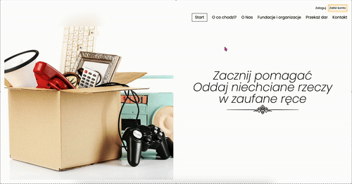
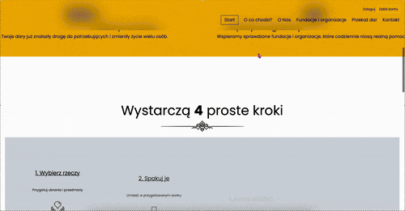

# ❤️ PCK — Charity Donation Platform

A modern landing page for the **Polish Red Cross (PCK)-style donation platform**, built with **HTML, CSS (TailwindCSS CDN)**, and **vanilla JavaScript**.  
The project showcases smooth GSAP animations, responsive navigation, and a clear donation flow.  

> Built by **Xebec13**.

---

## ✨ Features

- 📱 **Responsive navigation** (desktop & mobile hamburger menu)
- 🎬 **GSAP animations** (hero, scroll-triggered sections, parallax effects)
- 📊 **Statistics section** highlighting impact (donated bags & supported organizations)
- 🔄 **Step-by-step donation flow** (4 clear illustrated steps)
- 🧑‍🤝‍🧑 **About section** with parallax image reveal
- 🏛️ **Foundations list** with staggered scroll animations
- 📩 **Contact form in footer** with focus & hover effects

---

## 🛠️ Tech Stack

- **HTML5**  
- **Tailwind CSS (via CDN)**  
- **Vanilla JavaScript**  
- **GSAP**  

---

## 🎥 Preview GIFs

Here’s how the website looks in action:  

### Nav Hero Divider

### About Steps Footer

